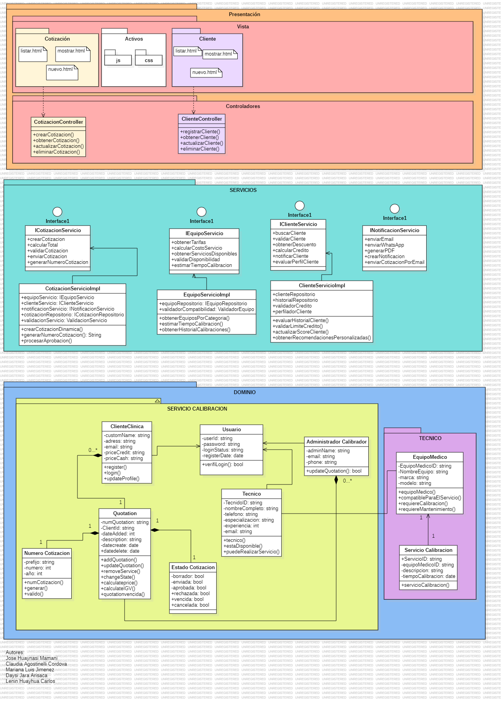

# IS1 Cotizaciones Django

Sistema de gestión de cotizaciones para servicios de calibración y mantenimiento de equipos médicos, dirigido a clínicas y hospitales.

## Descripción del proyecto

Este proyecto permite a empresas prestadoras de servicios de calibración y mantenimiento de equipos médicos gestionar cotizaciones de manera eficiente. El sistema cuenta con dos tipos de usuarios:

- **Administrador de la empresa**: Puede crear, modificar y eliminar cotizaciones
- **Personal de clínica/hospital**: Solo puede visualizar las cotizaciones asignadas

## Tecnologías utilizadas

- **Python 3.11.9** ([descargar](https://www.python.org/downloads/release/python-3119/))
- **Django 5.2.4**
- **SQLite** (base de datos por defecto)

## Estructura del proyecto

```
cotizaciones/
├── core/                    # Lógica principal de la aplicación
│   ├── dominio/            # Entidades y lógica de negocio
│   ├── servicios/          # Interfaces y servicios
│   └── presentacion/       # Controladores y vistas
├── cotizaciones/           # Configuración del proyecto Django
├── db.sqlite3             # Base de datos SQLite
└── manage.py              # Script de gestión de Django
```

## Requisitos previos

- Python 3.11.9 o superior
- pip (gestor de paquetes de Python)

## Instalación

1. **Clona el repositorio**
   ```bash
   git clone [url-del-repositorio]
   cd cotizaciones
   ```

2. **Instala las dependencias**
   ```bash
   pip install django
   ```

3. **Verifica la instalación**
   ```bash
   django-admin --version
   # Debe mostrar: 5.2.4
   ```

## Configuración inicial

1. **Configura la base de datos**
   ```bash
   python manage.py makemigrations
   python manage.py migrate
   ```

2. **Crea un superusuario (opcional)**
   ```bash
   python manage.py createsuperuser
   ```

## Ejecución

1. **Inicia el servidor de desarrollo**
   ```bash
   python manage.py runserver
   ```

2. **Accede a la aplicación**
   - Aplicación: [http://localhost:8000/](http://localhost:8000/)
   - Panel de administración: [http://localhost:8000/admin/](http://localhost:8000/admin/) (si creaste un superusuario)

## Funcionalidades principales

### Para administradores de la empresa
- Crear nuevas cotizaciones
- Modificar cotizaciones existentes
- Eliminar cotizaciones
- Gestionar clientes y equipos médicos

### Para personal de clínica/hospital
- Visualizar cotizaciones asignadas
- Consultar detalles de servicios de calibración
- Acceder a información de equipos médicos

## Testing

Ejecuta las pruebas con:
```bash
python manage.py test
```

## Documentación adicional

- La lógica de negocio principal se encuentra en `core/dominio/SERVICIO CALIBRACION/`
- Los servicios están implementados en `core/servicios/`
- Los controladores y vistas están en `core/presentacion/Controladores/`
- Consulta los diagramas UML incluidos para entender la arquitectura del sistema

## Contribución

Este proyecto está en desarrollo activo. Para contribuir:

1. Haz un fork del repositorio
2. Crea una rama para tu feature (`git checkout -b feature/nueva-funcionalidad`)
3. Realiza tus cambios y haz commit (`git commit -am 'Añade nueva funcionalidad'`)
4. Push a la rama (`git push origin feature/nueva-funcionalidad`)
5. Crea un Pull Request

## Licencia

[Especificar licencia del proyecto]

## Contacto

[Información de contacto del desarrollador o equipo]

